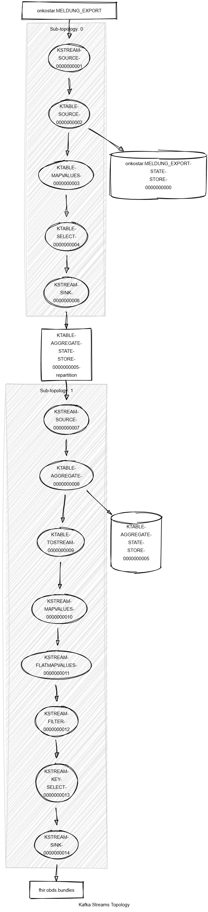

# obds-to-fhir

[](https://scorecard.dev/viewer/?uri=github.com/bzkf/obds-to-fhir)
[](https://slsa.dev)

This project maps [oBDS XML reports](https://www.basisdatensatz.de/basisdatensatz) to FHIR® resources conforming to the [Medizininformatik Initiative - Modul Onkologie](https://simplifier.net/guide/mii-ig-modul-onkologie-2024-de?version=current) profiles.

## Getting Started

### Kubernetes

To deploy to Kubernetes, we recommend the [stream-processors](https://github.com/miracum/charts/tree/master/charts/stream-processors) Helm chart.
See the [values.yaml](tests/k8s/values.yaml) as a reference. Of course, using a basic Deployment or StatefulSet manifest works just as well.

### Compose

Prerequisites:

- Container Runtime (Docker >= v28.0.1, containerd >= v1.7.25, Podman >= v5.4.1)
- Plugin to run [Compose files](https://www.compose-spec.io/), i.e. docker compose, nerdctl, or podman-compose.

Obds-to-fhir can be configured to either read oBDS XMLs from a filesystem directory or from an ONKOSTAR database table by leveraging [Kafka Connect](https://docs.confluent.io/platform/current/connect/index.html).

### Configuration

See [config.md](docs/config.md) for more information on configuring the job.

#### Reading oBDS XML from a directory

> [!NOTE]
> This assumes that one oBDS XML in the input folder contains all individual `Meldungen` of a single patient.
> This is necessary because in order to correctly set `Patient.deceased` in the FHIR resource,
> all `Meldungen` have to be processed and checked for the ones of type `Tod` when creating the Bundle.

A configuration profile called `process-from-directory` exists, which configures the application to read oBDS XMLs from
a directory called `/opt/obds-to-fhir/obds-input` inside the container, map them to FHIR resources and write the output
bundles to both `/opt/obds-to-fhir/fhir-output` and a Kafka topic called `fhir.obds`: [application-process-from-directory.yml](src/main/resources/application-process-from-directory.yml).

Here's how you can run the application this way:

```sh
mkdir ./fhir-output/

INPUT_DIRECTORY="../src/test/resources/obds3/" \
OUTPUT_DIRECTORY="../fhir-output" \
USER_ID="$(id -u)" \
GROUP_ID="$(id -g)" \
docker compose -f deploy/compose.yaml -f deploy/compose.process-from-directory.yaml run obds-to-fhir

docker compose -f deploy/compose.yaml down -v
```

this uses the [../src/test/resources/obds3/](src/test/resources/obds3/) folder as an input (the paths are relative to the [deploy/](deploy/) directory)
and the previously created `fhir-output/` folder as the output. To correctly set the owning user of the created files on the host filesystem,
the `UID` and `GID` of the container are overriden to the current user's.

At the same time, the created bundles are also written to the `fhir.obds` topic in Kafka. You can then, for example,
use [fhir-to-server](https://github.com/miracum/kafka-fhir-to-server) to send the resources to a FHIR server.

#### Reading oBDS XML from an ONKOSTAR database

To continuously process new oBDS XML from an ONKOSTAR database, you can use [Kafka Connect](https://docs.confluent.io/platform/current/connect/index.html)
to first load this table data into Kafka and then have the `obds-to-fhir` application process the messages. This allows for continuous processing as opposed to the
folder-based one-off execution.

See the [compose.dev.yaml](deploy/compose.dev.yaml) as an example for a full deployment, including Kafka, an Oracle database, and Kafka Connect.

The [image used to deploy Kafka Connect](https://github.com/miracum/util-images/blob/master/images/cricketeerone-kafka-connect/Dockerfile) includes
the dependencies necessary to connect to MySQL, MariaDB, or an Oracle databases. Once the service is running, you can configure the Connect task using
[deploy-connectors.sh](deploy/deploy-connectors.sh). Once it is running, XML data from the database is send to Kafka by running the query every 5 seconds.

You can see all available configuration options for the connector in the [Configuration Reference for JDBC Source Connector for Confluent Platform](https://docs.confluent.io/kafka-connectors/jdbc/current/source-connector/source_config_options.html).
There's also some more details on the setup at <https://github.com/bzkf/onco-analytics-on-fhir/tree/master/docker-compose#7-enable-kafka-connect-and-the-connector>.

## Used FHIR profiles

See [package.json](package.json) for a list of used packages and their versions.

## De-Identification

The generated FHIR resources contain identifying information directly taken from the source oBDS data.
This includes technical IDs taken from the Meldungen such as `Meldung_ID` and `SYST_ID` which are used to construct
the `Resource.identifier` elements. The identifier value is also used to compute the `Resource.id` by first appending
it to the identifier system and then hashing the resulting string using SHA-256.
To appropriately de-identify the generated resources, we therefore recommend de-identifying all `Resource.id`
and `Resource.identifier.value` elements. This may be done using pseudonymization or hashing with a secret salt.

`DiagnosticReport.conclusion` is mapped verbatim from the Pathologie Meldung's `Befundtext` element, depending on the
use case, it might be appropriate to remove this free-text data element as well.

An example `anonymization.yaml` config as used by the [FHIR Pseudonymizer](https://github.com/miracum/fhir-pseudonymizer)
may look like this:

```yaml
fhirVersion: R4
fhirPathRules:
  - path: Resource.id
    method: cryptoHash
  - path: Bundle.entry.fullUrl
    method: cryptoHash
  - path: Bundle.entry.request.url
    method: cryptoHash
  - path: nodesByType('Reference').reference
    method: cryptoHash
  - path: nodesByType('Identifier').value
    method: cryptoHash
  - path: DiagnosticReport.conclusion
    method: redact
parameters:
  dateShiftKey: ""
  dateShiftScope: resource
  cryptoHashKey: "a-long-secret-key"
  encryptKey: ""
  enablePartialAgesForRedact: true
  enablePartialDatesForRedact: true
  enablePartialZipCodesForRedact: true
  restrictedZipCodeTabulationAreas: []
```

The application also logs to stdout and the output always include the currently processed `Meldung_ID` and potentially other information
extracted directly from the source data. If this is a concern, we recommend disabling logging by in the container runtime used.

## Development

### oBDS v3 code generation

This task is included in default build task. In case you want to just generate oBDS v3 classes run:

```sh
./gradlew xsd2java
```

### Topology



### Dev Stack

- Kafka Broker: `$DOCKER_HOST_IP:9094`
- Kafka Connect: `$DOCKER_HOST_IP:8083`
- AKHQ: `$DOCKER_HOST_IP:8084`
- Oracle DB: `jdbc:oracle:thin:@//$DOCKER_HOST_IP:1521/FREEPDB1` (User: `DWH_ROUTINE`, Password: `devPassword`)

### Run with

From the ./deploy folder:

dc up:

```sh
sh up.sh
```

dc down

```sh
sh down.sh
```

deploy connectors

```sh
sh deploy-connectors.sh
```

reset topics

```sh
sh reset-topics.sh
```

## Image signature and provenance verification

Prerequisites:

- [cosign](https://github.com/sigstore/cosign/releases)
- [slsa-verifier](https://github.com/slsa-framework/slsa-verifier/releases)
- [crane](https://github.com/google/go-containerregistry/releases)

All released container images are signed using [cosign](https://github.com/sigstore/cosign) and SLSA Level 3 provenance is available for verification.

```sh
IMAGE=ghcr.io/bzkf/obds-to-fhir:v3.0.0-beta.162
DIGEST=$(crane digest "${IMAGE}")
IMAGE_DIGEST_PINNED="ghcr.io/bzkf/obds-to-fhir@${DIGEST}"
IMAGE_TAG="${IMAGE#*:}"

cosign verify \
   --certificate-oidc-issuer=https://token.actions.githubusercontent.com \
   --certificate-identity-regexp="https://github.com/miracum/.github/.github/workflows/standard-build.yaml@.*" \
   --certificate-github-workflow-name="ci" \
   --certificate-github-workflow-repository="bzkf/obds-to-fhir" \
   --certificate-github-workflow-trigger="release" \
   --certificate-github-workflow-ref="refs/tags/${IMAGE_TAG}" \
   "${IMAGE_DIGEST_PINNED}"

# use `beta` in `--source-branch` when verifying pre-releases
slsa-verifier verify-image \
    --source-uri github.com/bzkf/obds-to-fhir \
    --source-tag ${IMAGE_TAG} \
    --source-branch master \
    "${IMAGE_DIGEST_PINNED}"
```
