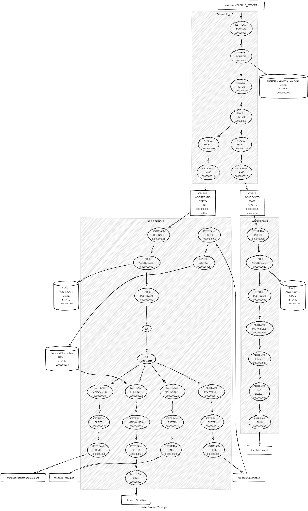

# obds-to-fhir

> [!IMPORTANT]
> Looking for the latest version supporting oBDS version 3 and the MII FHIR Profiles?
> Head to the `beta` branch: <https://github.com/bzkf/obds-to-fhir/tree/beta>

[](https://scorecard.dev/viewer/?uri=github.com/bzkf/obds-to-fhir)
[](https://slsa.dev)

This project contains a Kafka Stream processor that creates FHIR resources from Onkostar oBDS-XML data and writes them to a FHIR Topic.

## Used FHIR profiles

See [package.json](package.json) for a list of used packages and their versions.

### Observations

- Histologie (<https://simplifier.net/oncology/histologie>)
- Grading (<https://simplifier.net/oncology/grading>)
- TNMc (<https://simplifier.net/oncology/tnmc>)
- TNMp (<https://simplifier.net/oncology/tnmp>)
- Fernmetastasen (<https://simplifier.net/oncology/fernmetastasen-duplicate-2>)
- Tod Ursache (<https://simplifier.net/oncology/todursache>)

### Condition

- Primärdiagnose (<https://simplifier.net/oncology/primaerdiagnose>)

### Procedure

- Operation (<https://simplifier.net/oncology/operation>)
- Strahlentherapie (<https://simplifier.net/oncology/strahlentherapie>)

### MedicationStatement

- Systemtherapie (<https://simplifier.net/oncology/systemtherapie>)

### Patient

- Patient (<https://simplifier.net/medizininformatikinitiative-modulperson>)

## Dev

### Topology



### Dev Stack

- Kafka Broker: `$DOCKER_HOST_IP:9094`
- Kafka Connect: `$DOCKER_HOST_IP:8083`
- AKHQ: `$DOCKER_HOST_IP:8084`
- Oracle DB: `jdbc:oracle:thin:@//$DOCKER_HOST_IP:1521/FREEPDB1` (User: `DWH_ROUTINE`, Password: `devPassword`)

### Run with

From the ./deploy folder:

dc up:

```sh
sh up.sh
```

dc down (except of Oracle database)

```sh
sh down.sh
```

deploy connectors

```sh
sh deploy-connectors.sh
```

reset topics

```sh
sh reset-topics.sh
```
